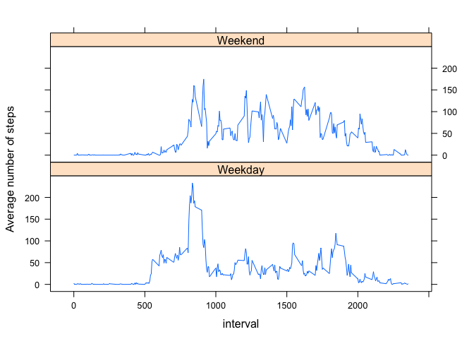

# Reproducible Research: Peer Assessment 1

## Loading and preprocessing the data

We will be using `dplyr` package for data processing and `lattice` for panel plot.

The below chunk of code tries to install the package if not available and then load it.


```r
if("dplyr" %in% rownames(installed.packages()) == FALSE) {install.packages("dplyr")};library(dplyr)
```

```
## 
## Attaching package: 'dplyr'
## 
## The following object is masked from 'package:stats':
## 
##     filter
## 
## The following objects are masked from 'package:base':
## 
##     intersect, setdiff, setequal, union
```

```r
if("lattice" %in% rownames(installed.packages()) == FALSE) {install.packages("lattice")};library(lattice)
```

Since the data file is in *zip* format, we should extract the data file. We can do it using the `unzip()` function


```r
unzip("activity.zip", exdir="./")
```

### Load the data

Next, let's load the data.


```r
data <- read.csv("activity.csv")
```

### Process/transform the data (if necessary) into a format suitable for your analysis

We will be using the `dplyr` package. So let's transform the data.


```r
activity <- tbl_df(data)
```

## What is mean total number of steps taken per day?

For this part of the assignment, we will be ignoring the missing values in the dataset.

### Make a histogram of the total number of steps taken each day

Let's calculate the total number of steps for each day.


```r
steps_per_day <- activity  %>%
    group_by(date) %>%
    summarise(total_steps = sum(steps))
```

And then draw the histogram


```r
hist(steps_per_day$total_steps,
     main = "Histogram of total number of steps per day",
     xlab = "Total number of steps per day")
```

 

### Calculate and report the mean and median total number of steps taken per day


```r
steps_mean <- mean(steps_per_day$total_steps, na.rm=TRUE)
steps_median <- median(steps_per_day$total_steps, na.rm=TRUE)
```

- Mean of toal number of steps taken per day is: 10766.1887
- Median of toal number of steps taken per day is: 10765

## What is the average daily activity pattern?

### Time Series

Make a time series plot (i.e. type = "l") of the 5-minute interval (x-axis) and the average number of steps taken, averaged across all days (y-axis)


```r
steps_by_interval <- activity  %>%
    group_by(interval) %>%
    summarise(avg_steps = mean(steps, na.rm=TRUE))

plot(steps_by_interval$interval, steps_by_interval$avg_steps, type="l",
     ylab = "Average Steps", xlab = "Time Interval")
```

 

### Maximum number of steps

Which 5-minute interval, on average across all the days in the dataset, contains the maximum number of steps?


```r
max_step_interval <- steps_by_interval[which.max(steps_by_interval$avg_steps), "interval"]
```

The time interval **835** has the maximum number of steps

## Imputing missing values

### Total number of missing values in the dataset


```r
num_of_na <- sum(is.na(activity$steps))
```

There are **2304** missing values in the dataset

### Strategy to fill missing values

The stratery that we are going to use is to repalce the missing values with the mean for that 5-minute interval

### New dataset without missing values

This chunk will implement the above strategy to fill up missing values and create a new dataset.

Basically we are using `mutate` method of `dpylr` package together with the `ifelse` statement to achieve this.

There are other ways like iterating over the rows to do this, but this method is the most concise as well as efficient way to do it.


```r
activity_without_na <- mutate(
        activity,
        steps = ifelse(is.na(steps),
              round(steps_by_interval[(steps_by_interval$interval==interval), 'avg_steps'][[1]]),
              steps)
)
```

### Plot histogram of the new dataset

Let's plot the histogram of the new dataset, by calculating the total number of steps


```r
new_steps_per_day <- activity_without_na  %>%
    group_by(date) %>%
    summarise(total_steps = sum(steps))

hist(new_steps_per_day$total_steps,
     main = "Histogram of total number of steps per day",
     xlab = "Total number of steps per day")
```

 

### Calculate and report the mean and median total number of steps taken per day for the new dataset


```r
new_steps_mean <- mean(new_steps_per_day$total_steps, na.rm=TRUE)
new_steps_median <- median(new_steps_per_day$total_steps, na.rm=TRUE)
```

- Mean of toal number of steps taken per day is: 10766.1111
- Median of toal number of steps taken per day is: 10763.5

### Difference between old and new dataset

| Dataset          | Mean                                 | Median                                 |
| ---------------- | -------------------                  | ---------------------                  |
| old (with NA)    | 10766.1887     | 10765     |
| new (without NA) | 10766.1111 | 10763.5 |

From the above table we can clearly see that the both mean and median has not changed much after replacing the missing values.

## Are there differences in activity patterns between weekdays and weekends?

### New factor variable

Create a new factor variable in the dataset with two levels – “weekday” and “weekend” indicating whether a given date is a weekday or weekend day


```r
activity_by_day_type <- mutate(activity_without_na,
        day_type = ifelse(weekdays(as.Date(date)) == "Sunday" | weekdays(as.Date(date)) == "Saturday",
              'Weekend',
              'Weekday')
)
activity_by_day_type$day_type = as.factor(activity_by_day_type$day_type)
```

### Panel plot

Let's create a panel plot


```r
activity_grouped_by_day_type <- activity_by_day_type %>%
    group_by(day_type, interval) %>%
    summarise(avg_steps = mean(steps, na.rm=TRUE))

xyplot(avg_steps ~ interval|day_type, data=activity_grouped_by_day_type, type="l",
   ylab="Average number of steps", layout = c(1, 2))
```

 

From the above graph it is clear that the activity pattern is different between weekdays and weekends.
